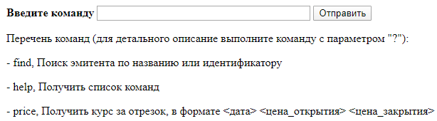

# Фондовый рынок
Набор приложений по работе с ценными бумагами российского фондового рынка. 

Реализованы функции:
* Поиска по списку эмитентов 
* Получение цен за отрезок времени

## Архитектура
Архитектура решения состоит из:
* [API](src/equities) получения данных фондового рынка
* [Ядра](src/interface/core), предоставляющего масштабируемый механизм декларации различных команд. 
Для добавления новой команды достаточно определить [метод исполнения команды](src/interface/core/commands/reference/find.py) и использваоть декоратор регистрации 
комнады (с указанием таких обязательных параметров как имя команды, описание и т.д.)  
После этого команда доступна во всех пользовательских интерфейсах. 
* Легко расширяемого механизма пользовательских интерфейсов
    * [CL](src/interface/cl/app.py) Командная строка
    * [WebServer](src/interface/webserver/app.py) Веб страница

### Пример поддержки новой команды "Получить общее кол-во эмитентов"
1 - Создадим новый модуль команды, задав имя команды, описание, синтаксис и определим механику выполнения
```python
@Manager.register('count', [], 'Получить общее кол-во эмитентов', '')
def _run(params: List[str]) -> List[str]:
    if len(params) == 0:
        return [f'Общее кол-во эмитентов "{len(ISSUER_LIST)}"']
    raise InvalidCmdParams()
```

2 - Поместим модуль с реализацией команды [в справочник конмад](src/interface/core/commands/reference/__init__.py)
```python
import src.interface.core.commands.reference.count
```

3 - Команда отображается в общем списке команд
```
python.exe /src/interface/cl/app.py
Перечень команд (для детального описание выполните команду с параметром "?"):
- help, Получить список команд
- find, Поиск эмитента по названию или идентификатору
- price, Получить курс за отрезок, в формате <дата> <цена_открытия> <цена_закрытия>
- count, Получить общее кол-во эмитентов
```

4 - По команде можно запросить помощь
```
python.exe src/interface/cl/app.py count ?
Получить общее кол-во эмитентов
count
```

5 - Результат выполнения команды
```
python.exe src/interface/cl/app.py count
Общее кол-во эмитентов "274"
```

## Работа в интерфейсе командной строки
1 - Получить перечень команд
```
python.exe src/interface/cl/app.py ?
Перечень команд (для детального описание выполните команду с параметром "?"):
- find, Поиск эмитента по названию или идентификатору
- help, Получить список команд
- price, Получить курс за отрезок, в формате <дата> <цена_открытия> <цена_закрытия>
```

2 - Получить ошибку выполнения конмады в случае не верного использования
```
python.exe src/interface/cl/app.py find га
Ошибка! Параметры команды введены не верно!

Поиск эмитента по названию или идентификатору
find|search <строка_поиска (миниму 3 символа)>
```

3 - Запросить помощь по команде
```
python.exe src/interface/cl/app.py find ?
Поиск эмитента по названию или идентификатору
find|search <строка_поиска (миниму 3 символа)>
```

4 - Выполнить команды. Найти газпром, затем запросить курс его акций 
```
python.exe src/interface/cl/app.py find газп
GAZP, ГАЗПРОМ ао
RTGZ, ГазпРнД ао
SIBN, Газпрнефть
```

```
python.exe src/interface/cl/app.py price gazp 27.01.20 30.01.20
27.01.20 235.01 230.96
28.01.20 232.61 235.00
29.01.20 236.90 232.00
30.01.20 230.70 231.53
```

## Работа в интерфейсе веб страницы
Работа с приложением через веб страницу аналогична работе через консоль. Веб сервер предоставляет поле для ввода 
команд и параметров с областью вывода результата.




## Пример поддержки нового пользовательского интерфейса на примере почтового сервера 
ЧЕРНОВИК